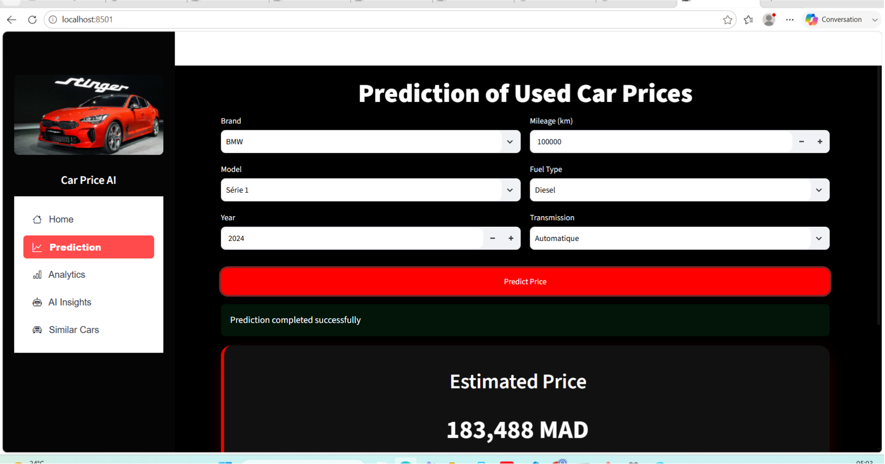
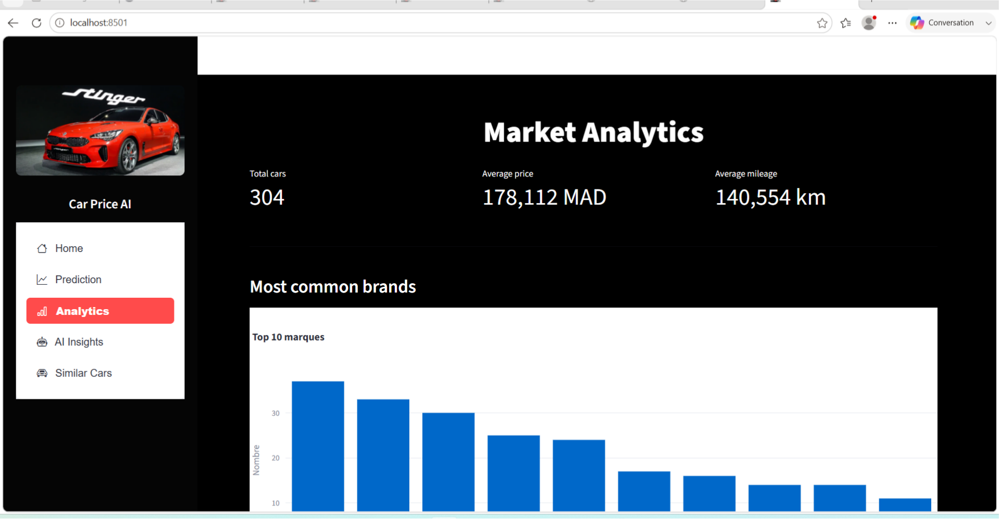
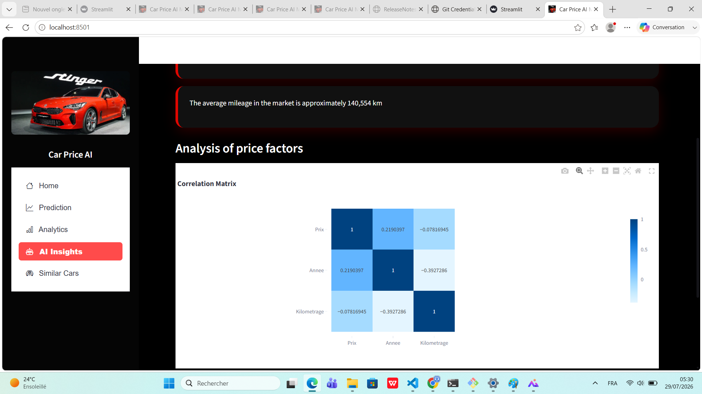
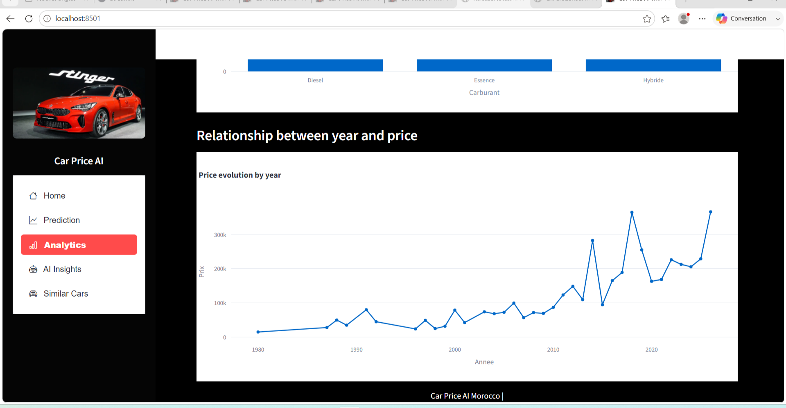
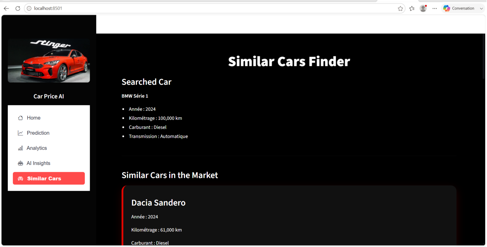

# Car Price Prediction in Morocco

A Machine Learning project that predicts the prices of used cars in Morocco using a Random Forest model. This project demonstrates the complete data science workflow, from data collection to deployment through an interactive Streamlit application.

---

## Project Overview

The objective of this project is to estimate the selling price of used cars based on their characteristics such as brand, model, year, fuel type, transmission, and mileage.

The project includes:

- Web scraping of used car listings
- Data cleaning and preprocessing
- Exploratory Data Analysis (EDA)
- Random Forest model training
- Interactive Streamlit dashboard
- Similar car recommendation

---

## Technologies Used

- Python
- Pandas
- NumPy
- Scikit-learn
- Streamlit
- Selenium
- BeautifulSoup
- Matplotlib
- Joblib

---

## Project Structure

```text
Car-Price-Prediction/
│
├── app_v2.py
├── analytics.py
├── prediction.py
├── feature_importance.py
├── similar.py
├── data/
├── models/
├── notebooks/
├── assets/
└── README.md
```

---

## Installation

Clone the repository:

```bash
git clone https://github.com/Allae20/Car-Price-Prediction.git
```

Go to the project folder:

```bash
cd Car-Price-Prediction
```

Install the required packages:

```bash
pip install -r requirements.txt
```

Run the application:

```bash
streamlit run app_v2.py
```

---

## Application Preview

### Price Prediction



### Data Analysis



### Correlation Matrix



### Additional Data Analysis



### Similar Cars



---

## Future Improvements

- Improve model accuracy using advanced algorithms
- Collect a larger dataset
- Deploy the application online
- Add more interactive visualizations

---

## Author

**Allae Elbaze**

Master's Student in Computer Science and Artificial Intelligence

Ibn Tofail University – Morocco
